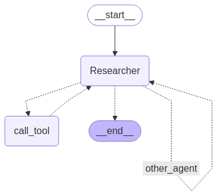

# ai_agent_paper_hackathon

This code builds an application capable of searching the arXiv database to recommend relevant papers in related fields and conducting analysis on provided research papers.

## AI_Agent Tech Stack

The agent is constructed using the Python language and the LangGraph framework, integrating DeepSeek-R1 as the LLM, and employing the arxivtools provided by LangGraph as the research paper search tool. Below is the basic structure of the agent:



## Backend Tech Stack

The backend is built with Python using the FastAPI framework. It utilizes Pydantic for data modeling and adopts a modular structure to support maintainable and extensible development. The backend exposes RESTful APIs, supports CORS, and serves as the primary logic engine for the paper analysis platform.

- **Language**: Python 3.10+
- **Web Framework**: FastAPI
- **Data Modeling**: Pydantic
- **Architecture**: Modular (API / Services / Models / Core)
- **Runtime**: ASGI-compatible (Uvicorn / Gunicorn / Docker)

## Functional Modules Overview

### 📁 app/api

API route definitions that expose functionality to the frontend:

- **endpoints.py**: Main API router combining endpoints for uploading, chatting, analyzing papers, etc.
- **file_ops.py**: File operations such as upload, delete, restore, and bulk download. Includes logging and recycle-bin mechanism.
- **full_content.py**: APIs for extracting full content and structured sections from PDFs.

### 📁 app/services

Service layer handling business logic:

- **pdf_parser.py**: Extracts metadata and structural content from PDF documents.
- **ai_agent_paper_analysis.py**: Define the agent structure and build AI agent logic for summarizing, questioning, and analyzing papers.
- **agent/**: Constructs multi-agent system including tool registration, routing logic, and task nodes.

#### 📁 app/services/agent

The agent layer constructs the key graph structures of the agent:

- **build_agent.py**: Define and create basic agent.
- **build_agent_node.py**: Translate the agent output into a format suitable for appending to the global state.
- **build_router.py**：Define the router function.

### 📁 app/models

- **schemas.py**: Defines Pydantic models for request and response schemas.

### 📁 app/core

- **config.py**: Core application configuration (e.g., logging, CORS).

## 🗂️ Project Structure

```
ai_agent_project/
├── app/
│   ├── api/                # API route definitions
│   ├── core/               # Core config and utilities
│   ├── models/             # Pydantic schemas
│   └── services/           # Business logic and services
├── main.py                 # FastAPI entry point
├── requirements.txt        # Dependencies
├── pdf_upload_count.json   # Upload count tracker
└── README.md               # Project documentation
```

## 🚀 Getting Started

### Install Dependencies

```bash
pip install -r requirements.txt
```

### Start Development Server

```bash
uvicorn main:app --reload
```

### Test API Endpoints

FastAPI provides built-in interactive docs:

- Swagger UI: http://localhost:8000/docs
- ReDoc: http://localhost:8000/redoc

## 🌐 CORS Support

CORS is enabled by default, allowing frontend apps like:

```python
origins = [
    "http://localhost:3000",
    "https://app.example.com"
]
```

## 🔧 Environment Variables (Optional)

You can use a `.env` file to define environment-specific variables like logging levels, API keys, etc. (not required for basic use).

---

This backend supports an AI-powered research assistant for analyzing academic papers. It is designed to work seamlessly with the frontend interface and provides endpoints for intelligent upload, parsing, and document interaction.
