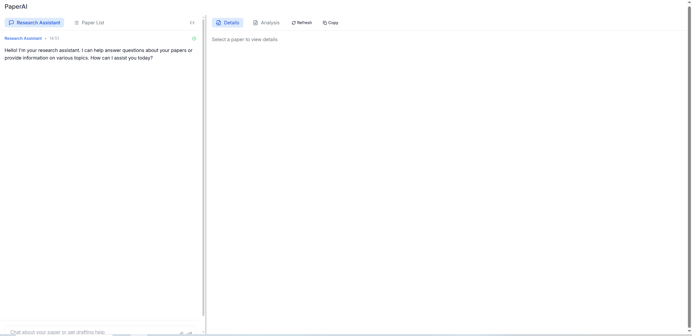

# ai_agent_paper_hackathon

This code builds an application capable of searching the arXiv database to recommend relevant papers in related fields and conducting analysis on provided research papers.

## AI_Agent Tech Stack

The agent is constructed using the Python language and the LangGraph framework, integrating DeepSeek-R1 as the LLM, and employing the arxivtools provided by LangGraph as the research paper search tool. Below is the basic structure of the agent:


## Backend Tech Stack

The backend is built with Python using the FastAPI framework. It utilizes Pydantic for data modeling and adopts a modular structure to support maintainable and extensible development. The backend exposes RESTful APIs, supports CORS, and serves as the primary logic engine for the paper analysis platform.

- **Language**: Python 3.10+
- **Web Framework**: FastAPI
- **Data Modeling**: Pydantic
- **Architecture**: Modular (API / Services / Models / Core)
- **Runtime**: ASGI-compatible (Uvicorn / Gunicorn / Docker)
- 
- ## Frontend Tech Stack

We chose to develop a web-based application. To ensure service stability and a flexible development experience, we adopted the following tech stack and deployed the frontend separately with a fixed domain. This separation of frontend and backend keeps the backend environment clean and maintainable.

- **Framework**: Next.js 14 (React)
- **Styling**: Tailwind CSS
- **State Management**: React Context API
- **API Communication**: Fetch API
- **Markdown Rendering**: React Markdown

## User Experience Design

From a UX perspective, the frontend is designed to minimize researchers’ cognitive load. The top priority is intuitive UI and clear interaction logic with zero learning curve. The layout is clean and simple, allowing users to focus on paper analysis. It consists of a title bar and resizable left-right panels.

### Layout Overview

- **Left Panel** (default width: 30%): Contains the AI assistant and paper list. It is collapsible to free up space for the main content.
- **Right Panel** (default width: 70%): Displays paper content and structured analysis.

**Focus Guidance**: Frequent user actions occur on the left; visual attention is directed to the right. Panel sizes can be adjusted by dragging the separator.



## Feature Guide

Based on this layout, the frontend implements concrete features across three modules: Research Assistant, Paper Management, and Text Analysis.

- **Paper Management Module**: 
  - Upload papers with progress indication
  - View and sort the paper list by title, year, etc.
  - Safe deletion and restore via recycle bin modal
  - Batch operations: select multiple papers for bulk download or deletion
  - Quick copy of paper info (title, authors, etc.)

- **Research Assistant Module**: 
  - Chat UI for natural language interaction with AI
  - Access via the "Research Assistant" tab in the left panel
  - Type queries in the bottom input field
  - Upload PDFs directly in chat using the paperclip icon
  - **Context-aware and rich text support in replies**

- **Text Editor Module**: 
  - Smart extraction of title, authors, abstract
  - Automatic detection of paper sections
  - Generate full paper analysis
  - Refresh button to re-analyze
  - One-click copy and auto-save of edited content
  - **Supports Markdown**, including code blocks and tables

## Functional Modules Overview

### 📁 app/api

API route definitions that expose functionality to the frontend:

- **endpoints.py**: Main API router combining endpoints for uploading, chatting, analyzing papers, etc.
- **file_ops.py**: File operations such as upload, delete, restore, and bulk download. Includes logging and recycle-bin mechanism.
- **full_content.py**: APIs for extracting full content and structured sections from PDFs.

### 📁 app/services

Service layer handling business logic:

- **pdf_parser.py**: Extracts metadata and structural content from PDF documents.
- **ai_agent_paper_analysis.py**: Define the agent structure and build AI agent logic for summarizing, questioning, and analyzing papers.
- **agent/**: Constructs multi-agent system including tool registration, routing logic, and task nodes.

#### 📁 app/services/agent

The agent layer constructs the key graph structures of the agent:

- **build_agent.py**: Define and create basic agent.
- **build_agent_node.py**: Translate the agent output into a format suitable for appending to the global state.
- **build_router.py**：Define the router function.

### 📁 app/models

- **schemas.py**: Defines Pydantic models for request and response schemas.

### 📁 app/core

- **config.py**: Core application configuration (e.g., logging, CORS).

## 🗂️ Structure

```
Backend Structure
ai_agent_project/
├── app/
│   ├── api/                # API route definitions
│   ├── core/               # Core config and utilities
│   ├── models/             # Pydantic schemas
│   └── services/           # Business logic and services
├── main.py                 # FastAPI entry point
├── requirements.txt        # Dependencies
├── pdf_upload_count.json   # Upload count tracker
└── README.md               # Project documentation

Frontend Structure
paper-ai/
├── app/                  # Next.js application directory
│   ├── layout.tsx        # Main layout component
│   ├── page.tsx          # Main page component
│   └── globals.css       # Global styles
├── components/           # React components
│   ├── chat-sidebar.tsx  # Chat sidebar
│   ├── header.tsx        # Header
│   ├── product-list.tsx  # Paper list
│   ├── text-editor.tsx   # Text editor
│   └── ...               # Other components
├── lib/                  # Utility functions and API clients
│   ├── chat-api.ts       # Chat API client
│   ├── config.ts         # App configuration
│   ├── paper-api.ts      # Paper API client
│   ├── paper-context.ts  # Paper context
│   └── ...               # Other utilities
├── public/               # Static assets
├── .env.local            # Local environment variables
├── next.config.mjs       # Next.js config
└── package.json          # Project dependencies

```


## 🚀 Getting Started

### Install Dependencies

```bash
pip install -r requirements.txt
```

### Start Development Server

```bash
uvicorn main:app --reload
```

### Test API Endpoints

FastAPI provides built-in interactive docs:

- Swagger UI: http://localhost:8000/docs
- ReDoc: http://localhost:8000/redoc

## 🌐 CORS Support

CORS is enabled by default, allowing frontend apps like:

```python
origins = [
    "http://localhost:3000",
    "https://app.example.com"
]
```

## 🔧 Environment Variables (Optional)

You can use a `.env` file to define environment-specific variables like logging levels, API keys, etc. (not required for basic use).

